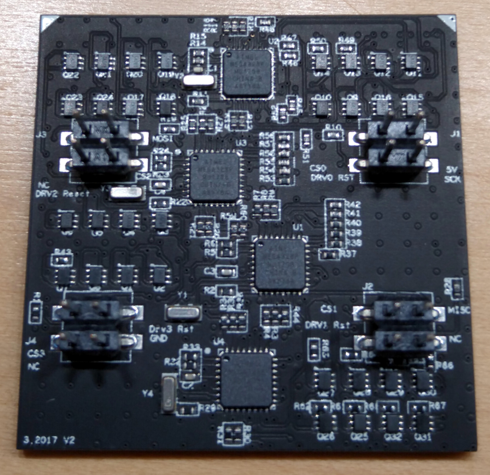

# Driver PCB

The driver board measures 40×40mm² and has four 4×4 male pins (>=v0.2) or two 2×6 female sockets (v0.1) on the bottom layer. The top of the driver board is either covered in LEDs (>=v1.0) or has connectors to off-the-shelf LED matrices. [Version 2](#driver-v2) makes the use of different colors easier, but is functionally very similar to [version 1](#driver-v1).

Historically, the driver used four off-the-shelf LED panels for each of the quadrants (<=v0.3). Since then, each of the quadrants has its own micro controller unit (MCU) that handles a matrix of 8×8 LEDs. The panels with two 2×6 connectors use I²C for the communication between comm and driver, since version v0.2 SPI was used for this internal communication as well. The MCUs translate the brightness commands for pixels into pulse-width modulation for individual LEDs.

{:.ifr}

The difference between driver-v2 and driver-v1 is the internal wiring of individual columns. The image on the right shows the LEDs on a driver with an overlay on how they are connected. The cyan and magenta lines show, which LEDs belong to a single column in [driver-v2.x](#driver-v2), the yellow lines on the right show the connections in [driver-v1.x](#driver-v1). Currently, we only share the design files for a [driver-v1.x](#driver-v1).

If you intend to use one-colored drivers, we recommend [driver-v1](#driver-v1) as they are slightly easier to debug on a hardware level, should that be necessary. Currently, we have not shared the [driver-v2](#driver-v2) designs, but please [get in contact](../../../Contact.md) if you would like to have them.

## Panel Driver PCB v2.x
{:#driver-v2 .clear}

{:.ifr}

Driver boards >=v2.0 are PCBs measuring 40×40mm² and with the same connectors as the [driver-v1.x](#driver-v1). The strongest visible difference is in the location of the MCUs: in version-2.x the four square ATmega328 chips positioned in a straight line. The difference is in how the LEDs are connected: the first LED from the first row is connected to the second LED in the second row, the first in the third row,  the second in the fourth row, and so on. Basically, two neighboring columns are interleaved. This positioning increases the color resolution for multicolored displays especially with two colors. In most matrices, individual LEDs are addressed by closing a circuit for a row and column at the same time. The LED at the intersection of the activated row and column then turns on. Either the row or column needs to provide the current limiting resistor that is specific to the type of LED it connects to.

For the G4 drivers, a column of eigth LEDs within a quadrant is connected to such a resistor. This means, all LEDs of a column need to be of the same type. If you want to use differently colored LEDs, then they need to be organized by columns with their according resistor. For a bi-colored panel where the electrical columns are organized in physical columns, even columns would have one color *A*, odd columns another *B*. A moving bar of color *A* would therefore move from column 1 to 3 to 5 and so on, skipping the columns of different color. By interweaving the colors in such a checkerboard layout, a moving bar of color *A* could move at a higher resolution from columns 1 to 2 to 3 and so on. This comes at the cost of density, so [driver-v1.x](#driver-v1) and [driver-v2.x](#driver-v2) are for different use cases.

Functionally, the [driver-v2.x](#driver-v2) is very similar to the [driver-v1.x](#driver-v1). During the creation of visual patterns, a [configuration option has to be set](../../Display_Tools/Motion_Maker_G4/About Motion Maker.md#checkerboard), everything is the same for setting up and running an arena with either [driver-v1.x](#driver-v1) or [driver-v2.x](#driver-v2). But because of this small difference, mixing different versions of driver-boards in the same arena is currently not supported.

## Panel Driver PCB v1.x
{:#driver-v1 .clear}

{:.ifr}

Driver boards >=v1.2 are 6 layer PCBs measuring 40×40mm². Note the different position of the MCUs, which makes this version easily distinguishable from [driver-v2.x](#driver-v2). The production files are currently available in version [driver-v1.5](https://github.com/floesche/Panel-G4-Hardware/tree/master/production-v1/). All components are SMD with the smallest component measuring 0402 (imperial) or 1005 (metric). Therefore factory assembly is recommended.

### Function

The driver PCB receives signals on the four connectors (J1…J4), one for each quadrant. Each quadrant uses an ATMEGA328P-MU (U1…U4) to turn the LEDs (D1…256) on and off. The LEDs in each of the four quadrants are organized in an 8×8 matrix. The ATMEGAs use a row-scan algorithm, where at each point in time a single row is active. From this row any of the 8 LEDs can be turned on or off. Brightness is regulated through pulse width modulation. Each column uses its own resistor, therefore LEDs of different colors can be used for each column.

### Design

Notice, that the second to the bottom layer is a ground layer. This design choice was intended to keep the electrical noise for ephys experiments down. So far we can't quantify if it worked, but we wanted to point out one of the not so obvious design choices.

The files starting with version v1.2 are in its own dedicated repository [Panel-G4-Hardware](https://github.com/floesche/Panel-G4-Hardware/). The driver board was designed in-house at Janelia's [jET](https://www.janelia.org/support-team/janelia-experimental-technology) group. The [OrCAD](https://www.orcad.com/) EDA source file is provided for reference, although the latest production files might not always correspond with the design file version.

### Production

The Panel Driver PCBs are built from 6 layers. The BOTTOM layer contains all LEDs, followed by the GND layer, two logic layers, a power layer, and the TOP layer for the electronic components such as the MCUs and connectors.

# Historic designs

These designs are kept for historic reasons and to debug existing systems. If you have one of them, you probably know what to do and just need the files. If you are building a new system, don't use them.

## Panel Driver PCB v0.2 to 0.4
{:.clear}

{:.ifr}

Earlier versions of the driver were designed for off-the-shelf LED matrices. Historically this is what has been used in Generation 3 LED arenas and before as well. The latest version of the off-the-shelf LED matrices version, which is designed for four 20×20mm² components, is [driver-v0.4.2](https://github.com/floesche/panels_g4_hardware/tree/master/atmega328/four_panel/20mm_matrix/ver4/driver). You can find the driver designs of earlier versions in the same repository by navigating a few directories up.

{:.ifr}
The difference between these versions is minimal and can be documented if necessary. In general, they should be compatible between design iterations. Please [get in contact](../../../Contact.md) if you need further information.
{:.clear}

## Panel Driver PCB v0.1
{:#driver-v0p1}

The first driver with ATmega MCU used I²C for the communication between controller and arena. They are not compatible with later versions.

## other Panel Drivers

The [panel_g4_hardware](https://github.com/floesche/panels_g4_hardware) repository contains two other directory trees with designs using max6960 or stm32 MCUs. They were initial prototypes from around 2013 but should not exist in the wild. [Get in contact](../../../Contact.md) if you have one and need explanation about the nature of these historic files.